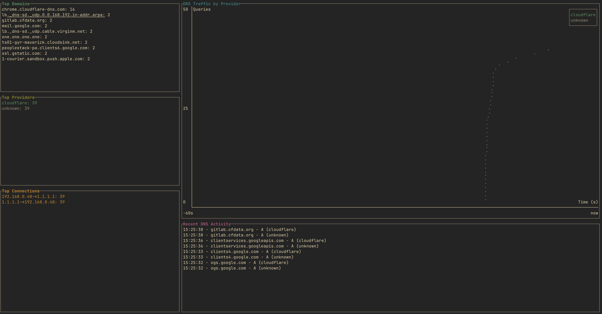

# DustCloud

A Rust CLI tool for monitoring DNS requests on macOS, with a focus on traffic routed through Cloudflare (1.1.1.1).



## Requirements

- Rust and Cargo installed
- Administrative privileges (needed for packet capture)
- macOS (primarily designed for macOS, but may work on other platforms)

## Building

To build DustCloud from source:

```bash
# Clone the repository
git clone https://github.com/rupert648/dustcloud.git
cd dustcloud

# Build the project
cargo build --release

# The binary will be available at target/release/dustcloud
```

## Usage

Basic usage:

```bash
# Run with default settings (monitors all DNS traffic)
sudo ./dustcloud

# Specify DNS providers to monitor
sudo ./dustcloud --dns-providers cloudflare,google

# Use a specific network interface
sudo ./dustcloud -i en0
```

Note: Administrative privileges are required for network packet capture.

### Options

```
-i, --device <DEVICE>            Specify network interface to use (e.g., en0)
    --disable-tui                Disables the terminal UI
    --dns-providers <PROVIDERS>  Specify DNS providers to monitor (comma-separated: 
                                 cloudflare,google,opendns,quad9,adguard,cleanbrowsing)
-l, --list-devices               List available network devices and exit
-v, --verbose                    Enable verbose output (cannot be used with --disable-tui)
    --continue-on-error          Continue capturing on error
-h, --help                       Print help
-V, --version                    Print version
```

## Examples

List available network interfaces:
```bash
./dustcloud -l
```

Monitor only Cloudflare DNS requests on the en1 interface with verbose output:
```bash
sudo ./dustcloud -i en1 --dns-providers cloudflare -v
```

Disable the TUI for logging to console or piping output:
```bash
sudo ./dustcloud --disable-tui > dns_log.txt
```

## License

MIT
